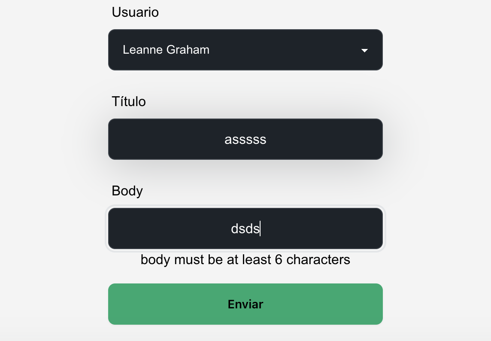

# Arquitectura limpia con React + TypeScript + Vite

# Crear nueva funcionalidad (formulario para crear post seleccionando el usuario)

## 1. Crear el modelo

Se usa la siguiente api para poder probar la funcionalidad: https://jsonplaceholder.typicode.com/posts
- Instalar las siguientes librerías para manejo de formularios: npm install react-hook-form yup @hookform/resolvers

- Instalar daisyUI:
`npm i -D daisyui@latest`

Entonces adicionar a  tailwind.config.js configuración:

```js
module.exports = {
  //...
  plugins: [require("daisyui")],
}

```

 1.1 En domain crear los modelos:
- Crear carpeta `post` y dentro de ella las carpetas `models`, `repository` y `symbols`.
-  Para crear el modelo para las peticiones que haremos desde el front:
  
```typescript
export class PostRequestDom {
    constructor(
      public userid: string,
      public title: string,
      public body: string
    ) {}
}

```
- El modelo para las respuestas que recibiremos en el front:
  
```typescript
export class PostResponseDom {
    constructor(
      public username: string,
      public title: string,
      public body: string
    ) {}
}
```

1.2 Crear el repositorio para exponer los contratos, en la carpeta `repository`, en este caso un contrato para crear un post:

```typescript
import { Failure, Result } from "@core/index";
import { PostRequestDom } from "../models/post-request.dom";
import { PostResponseDom } from "../models/post-response.dom";

export interface PostRepository{
   
    create(request: PostRequestDom): Promise<Result<PostResponseDom, Failure>>
   
}
```
- Crear los simbolos que va a permitir enlazar el repositorio y los contratos:

```typescript
export const POST_SYMBOLS = {
    POST_REPOSITORY: Symbol('POST_REPOSITORY'),
    
    POST_CREATE: Symbol('POST_CREATE'),

}
```

## 2. Crear la capa de aplicacion 
- Crear una carpeta `post` y en `commands` crear `create-post.usecase`

```typescript
import { inject, injectable } from "inversify";
import  { Command, Failure, Result } from "@core/index";
import { POST_SYMBOLS,type PostRepository, PostResponseDom, PostRequestDom,  } from "@domain/post";


@injectable()
export class CreatePublicationUseCase extends Command<Promise<Result<PostResponseDom, Failure>>,PostRequestDom > {
    constructor(
        @inject(POST_SYMBOLS.POST_REPOSITORY)
        private readonly _postRepository: PostRepository,
    ) {
        super()
    }
    execute = (request: PostRequestDom): Promise<Result<PostResponseDom, Failure>> => this._postRepository.create(request)
}

```
## 3. Crear la implementación del repositorio en la capa de infraestructura:

- En la carpeta `infraestructure` crear carpetas `post`, `dtos` y `mapper`.
- En la raiz de la carpeta `post` crear el archivo `post-impl.respository.ts`:
```typescript
import { Result, Failure, Left, HTTP_CLIENT_SYMBOLS, type HttpClient, HttpClientOptions, UnknowFailure, Right } from "@core/index";
import { PostRequestDom } from "@domain/post/models/post-request.dom";
import { PostResponseDom } from "@domain/post/models/post-response.dom";
import { PostRepository } from "@domain/post/repository/post.repository";
import { inject, injectable } from "inversify";
import { PostMapper } from "./mapper/post.mapper";
import { PostResponseDto } from "./dtos/post.dto";

@injectable()
export class PostImplRepository implements PostRepository  {
    baseURL: unknown = process.env.VITE_BASE_URL
    constructor(
        @inject(HTTP_CLIENT_SYMBOLS.FETCH)
        private readonly httpClient: HttpClient,
    ) {}
    async create(request: PostRequestDom): Promise<Result<PostResponseDom, Failure>> {
        //console.log("infra", request)
        const options = <HttpClientOptions>{
            path: `${this.baseURL}/posts`,
            body: PostMapper.toCreateDto(request),
        };
        const result = await this.httpClient.post<PostResponseDto>(options)
        if(!result.ok){
           return new Left<Failure>(new UnknowFailure(`Unknow error: ${result.error}`))
           //otras operaciones
           
        }
        return new Right<PostResponseDom>(PostMapper.toDom(result.data)) 
      
    }
}
```
- Para la linea de código dentro de `options`, `body: PostMapper.toCreateDto(request)`, debemos crear un Dto que nos ayude a no exponer el objeto del modelo de dominio, sino un objeto que lo represente, esto nos ayuda a desacoplar los datos ya que pueden ser diferentes de la api y nuestro front:
  
En la carpeta `dtos` de `post` creamos el siguiente dto:

```typescript
  interface PostCommonDto {

    userId:number,
    title:string,
    body:string,

  }

  export interface CreatePostRequesDto extends PostCommonDto{

  }

  export interface PostResponseDto extends PostCommonDto{
    id: number,

  }
```
- Luego debemos crear el mapeador de objeto de dominio a dto y viceversa:
En la carpeta `mapper` dentro de la carpeta `post` crear el siguiente mapeador:
```typescript
import { PostRequestDom, PostResponseDom } from "@domain/post";
import { CreatePostRequesDto, PostResponseDto } from "../dtos/post.dto";


export class PostMapper {
    static toDom(dto: PostResponseDto): PostResponseDom {
      return new PostResponseDom(
       dto.userId.toString(),
       dto.title,
       dto.body
    
      );
    }
  
    static toCreateDto(dom: PostRequestDom): CreatePostRequesDto {
      return <CreatePostRequesDto>{
        title:dom.title,
        body:dom.body,
        userId: Number(dom.userid)
       
      }
  }

 
  }
```
Observemos el código anterior, los parámetros que recibe, si recibe un objeto de dominio devuelve un dto y viceversa.

- Para hacer un enlace entre el repositorio y su implementación y los casos de uso creamos el módulo `post.module.ts`, en la raiz de la carpeta `post`:
```typescript
import { ContainerModule } from "inversify";
import "reflect-metadata";
import { POST_SYMBOLS, PostRepository } from "@domain/post";
import { PostImplRepository } from "./post-impl.repository";
import { CreatePublicationUseCase } from "@application/post/commands/create-post.usecase";

const postModule = new ContainerModule((bind) => {
  bind<PostRepository>(POST_SYMBOLS.POST_REPOSITORY)
    .to(PostImplRepository)
    .inSingletonScope();

  bind<CreatePublicationUseCase>(POST_SYMBOLS.POST_CREATE)
    .to(CreatePublicationUseCase)
    .inSingletonScope();

  
});
export { postModule };
```

## 4. En la capa de "di" cargamos el módulo creado en el paso anterior:
- `di.load(postModule);` este sería el código completo del inyector:
  
```Typescript
import { Container } from "inversify";
import { userModule } from "@infrastructure/users/index";
import { httpClientModule } from "@core/index";
import { taskModule } from "@infrastructure/task";
import { postModule } from "@infrastructure/post/post.module";

// Crear contenedor de Inversify
const di = new Container();
//Transversales
di.load(httpClientModule)
// Cargar módulos en el contenedor
di.load(userModule);
di.load(taskModule);
//new module
di.load(postModule);
export { di };
```
## 5. En la capa de `presentation` creamos un hook `use-post.ts`:
```Typescript
import React, { useState } from 'react'

import { AllUsersUseCase } from '@application/users/index';

import { Failure, NoParams } from '@core/index';
import { CreatePublicationUseCase } from '@application/post/commands/create-post.usecase';
import { PostRequestDom, PostResponseDom } from '@domain/post';
import { UserDom } from '@domain/users';

function usePost(  allUserUseCase: AllUsersUseCase, 
    createPostUseCase: CreatePublicationUseCase

) {
    //const allUsersUseCase = di.get<AllUsersUseCase>(USER_SYMBOLS.USER_LIST);
    const [users, setUsers] = useState<UserDom[]>([]); 
    const [loading, setLoading] = useState<boolean>(true); 
    const [error, setError] = useState<boolean>(false); 

    React.useEffect(() => {
        async function fetchData() {
            const resultData = await allUserUseCase?.execute(NoParams)
            resultData.fold((data: UserDom[]) => setUsers(data), (_: Failure) => setError(true))
            setLoading(false)
        }
        fetchData()
    },[allUserUseCase])

    const addPost = async (newPost: PostRequestDom) => {
        const result = await createPostUseCase?.execute(newPost)
        result.fold((_: PostResponseDom) => {console.log("post",_)}, (_: Failure) => console.log("fall",_))
    };

    return {
        users,
        loading,
        addPost,
        error
    };
}
export { usePost }
```

## 6. Creamos un componente `PostFormYup.tsx`, con el siguiente contenido:

```Typescript
import { PostRequestDom } from "@domain/post";
import { UserDom } from "@domain/users"
import { yupResolver } from "@hookform/resolvers/yup";
import { useForm } from "react-hook-form"
import * as Yup from 'yup';

interface PostFormProps {
    users: UserDom[],
    onClick: (_:PostRequestDom) => void;

}

const PostFormYup =({users=[],onClick}:Readonly<PostFormProps>)=> {

    const validationSchema = Yup.object().shape({
        userid: Yup.string().required('user is required'),
        title: Yup.string()
          .required('title is required')
          .min(6, 'title must be at least 6 characters')
          .max(20, 'title must not exceed 20 characters'),
        body: Yup.string()
          .required('body is required')
          .min(6, 'body must be at least 6 characters')
          .max(20, 'body must not exceed 20 characters'),
    /*    email: Yup.string()
          .required('Email is required')
          .email('Email is invalid'),
         password: Yup.string()
          .required('Password is required')
          .min(6, 'Password must be at least 6 characters')
          .max(40, 'Password must not exceed 40 characters'),
        confirmPassword: Yup.string()
          .required('Confirm Password is required')
          .oneOf([Yup.ref('password'), null], 'Confirm Password does not match'), */
       // acceptTerms: Yup.bool().oneOf([true], 'Accept Terms is required')
      });

  const {
    register,
    handleSubmit,
    formState: { errors },
  } = useForm<PostRequestDom>({
    resolver: yupResolver(validationSchema)
  });
  const onSubmit = (data:PostRequestDom) => onClick(data)

  return (
    <form onSubmit={handleSubmit(onSubmit)} className="form-control w-full max-w-xs mx-auto text-white">
      <div className="grid grid-cols-1 gap-4">
        {/* Usuario */}
        <div>
          <label htmlFor="userid" className="label text-black">Usuario</label>
          <select id="userid" {...register("userid", { required: true })} className="select select-bordered w-full">
            {users.map(user => (
              <option key={user.id} value={user.id ?? ""}>{user.name}</option>
            ))}
          </select>
          <div className="invalid-feedback  text-black">{errors.userid?.message}</div>
        </div>
  
        {/* Titulo */}
        <div>
          <label htmlFor="title" className="label text-black">Título</label>
          <input className="input input-bordered w-full"
            id="title"
            aria-invalid={errors.title ? "true" : "false"}
            {...register("title", { required: true })}
          />
           <div className="invalid-feedback text-black">{errors.title?.message}</div>
        </div>
  
        {/* Body */}
        <div>
          <label htmlFor="body" className="label text-black">Body</label>
          <input className="input input-bordered w-full"
            id="body"
            aria-invalid={errors.body ? "true" : "false"}
            {...register("body", { required: true })}
          />
           <div className="invalid-feedback  text-black">{errors.body?.message}</div>
        </div>
  
        {/* Botón de envío */}
        <div>
          <input type="submit" className="btn btn-success w-full" />
        </div>
      </div>
    </form>
  );
  
}

export default PostFormYup
```

## 7. Llamar el componente en la pantalla principal, dentro de `page` puede ser en `TaskPage.tsx`:

- Se llama al "di" para pasarlo por parametro al hook usePost creado en el paso 5 al crear el hook: 
 
 ```Typescript
  const {users, addPost } = usePost(di.get<AllUsersUseCase>(USER_SYMBOLS.USER_LIST), di.get<CreatePublicationUseCase>(POST_SYMBOLS.POST_CREATE));

  ```
  luego tanto `users` como `addPost` se llaman en el componente `PostFormYup.tsx`:
 ```Typescript
  <PostFormYup users={users} onClick={function (_: PostRequestDom): void {
        addPost(_)
      } }/>
  ```
- Probamos con el comando `npm run dev`

## Componentes reutilizables - Sistema de diseño atómico

https://storybook.js.org/docs/writing-stories

