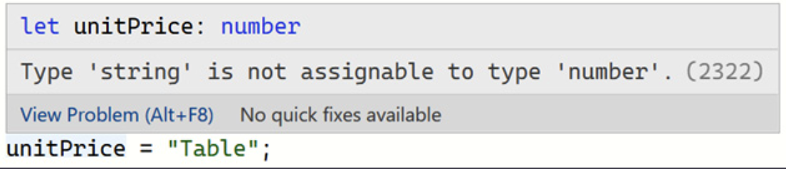
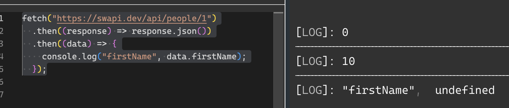
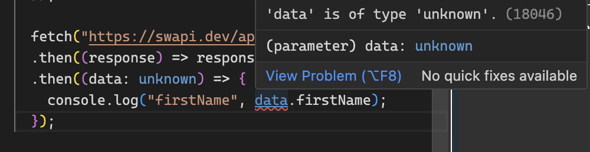
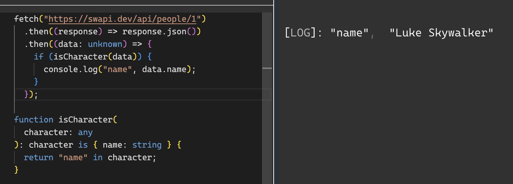
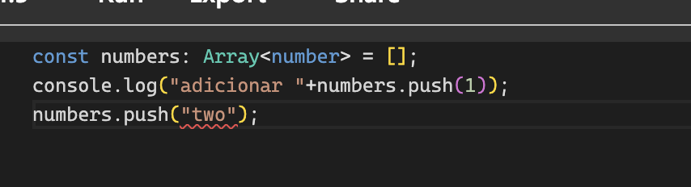
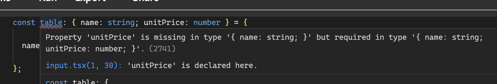

# Typescript
## Tipos de datos

- Objetivo: Comprender cómo se pueden declarar los tipos de TypeScript y cómo se infieren a partir de los valores asignados

### Tipos básicos
- Abrir consola online de Typescript: https://www.typescriptlang.org/play

```ts
let unitPrice: number;
unitPrice=10;
console.log(unitPrice) 

```
- Agregue una segunda línea al programa:

unitPrice = "Tabla";

Observe que aparece una línea roja debajo de Precio unitario en esta línea. Si pasa el cursor sobre el precio unitario subrayado, se describe un error de tipo :


 – Se detecta un error de tipo

 - Se puede agregar anotaciones de tipo a los parámetros de la función y al valor de retorno de una función usando la misma sintaxis que para anotar una variable

```typescript
function getTotal(
  unitPrice: number,
  quantity: number,
  discount: number
): number {
  const priceWithoutDiscount = unitPrice * quantity;
  const discountAmount = priceWithoutDiscount * discount;
  return priceWithoutDiscount - discountAmount;
}
```
* `let` permite que la variable cambie el valor después de la declaración, mientras que las variables constantes no pueden cambiar
```typescript
let total:number = getTotal(500, 10, 0.1);
console.log(total)
let total: string = getTotal(500, "one", 0.1);
```

### Inferencia de tipos

Las anotaciones de tipo son realmente valiosas, pero requieren la escritura de código adicional, TypeScript infiere el tipo de una variable cuando se le asigna un valor a partir de ese valor
```typescript
let flag = false;
```
Typescript infiere que es de tipo boleano
si en la siguiente linea escribo:` flag = "table";` ya typescript detecta un error y me dice que no puedo asignar un tipo string en un boleano declarado previamente

### Tipo ´Data´ (fechas)


Sabemos que el tipo Date no existe en JavaScript, pero afortunadamente, existe un tipo de Date en TypeScript. El tipo de Date de TypeScript es una representación del objeto Date de JavaScript.
```typescript
// let today: Date;
// today = new Date();

let today = new Date();
today.addMonths(2); //addMontos no existe debe dar error de inferencia
```

### Tipo `any`

Es una forma de optar por no realizar la verificación de tipos en una variable particular y se usa comúnmente para contenido dinámico o valores de bibliotecas de terceros

```typescript
let flagw;
```
Si se pasa el mouse inferirá que es "any"

### Tipo `unknown`

Es un tipo que podemos usarlo cuando no estamos seguros del tipo pero queremos interactuar con él de una manera fuertemente tipada.
```javascript
fetch("https://swapi.dev/api/people/1")
  .then((response) => response.json())
  .then((data) => {
    console.log("firstName", data.firstName);
  });
```
el resultado es:



Ahora coloque un el tipo `unknown` a la respuesta:
```typescript
  fetch("https://swapi.dev/api/people/1")
  .then((response) => response.json())
  .then((data: unknown) => {
    console.log("firstName", data.firstName);
  });
```
y va a aparecer asi:


Es decir infiere que hay un tipo desconocido
sin embargo al colocar un tipo valido, ejemplo ´name´ sigue mostrando error, esto porque el datos es `unknown` 
Podemos ampliar los datos y buscar una inferencia correcta y al hacerlo mejorar nuestro validación:

```typescript
fetch("https://swapi.dev/api/people/1")
  .then((response) => response.json())
  .then((data: unknown) => {
    if (isCharacter(data)) {
      console.log("name", data.name);
    }  
  });

function isCharacter(
  character: any
): character is { name: string } {
  return "name" in character;
}
```

Lo que se hizo fue agregar una validación, al validar toma el tipo de la funcion que valida, esto es un predicado de tipo. TypeScript limitará o ampliará el tipo de carácter a `{ name: string }` si la función devuelve verdadero . El predicado de tipo es verdadero en este ejemplo, por lo que el carácter se amplía a un objeto con una propiedad de tipo string o cadena

Y por supuesto desaparece el error de tipo:


 * Sin embargo, no puede interactuar con variables `unknown`  : la variable debe ampliarse a un tipo diferente antes de cualquier interacción.

### Tipo vacío

El tipo vacío se utiliza para representar el tipo de retorno de una función donde la función no devuelve un valor.

Como ejemplo, ingrese siguiente función en TypeScript Playground:

```typescript
function logText(text: string) {
  console.log(text);
}
```

Al pasar el cursor sobre el nombre de la función, se confirma que el tipo de retorno de la función recibe un tipo vacio o void.

### Tipo `never`

El  tipo `never` presenta algo que nunca ocurrirá y que normalmente se usa para especificar áreas de código inalcanzables. Exploremos un ejemplo en el Playground de TypeScript:
```typescript
function foreverTask(taskName: string): never {

  while (true) {
    console.log(`Doing ${taskName} over and over again       ...`);
  }

}
```

La función invoca un bucle infinito, lo que significa que nunca se sale de la función. Entonces, le hemos dado a la función una anotación de tipo de retorno de nunca porque no esperamos que se cierre la función. Esto es diferente de void porque void significa que saldrá , pero sin valor.

Si quitamos "never" typescrip es incapaz de inferir el tipo  `never` en este caso. En cambio, infiere que el tipo de retorno es void , lo que significa que la función saldrá sin valor, lo cual no es el caso en este ejemplo. Este es un recordatorio para verificar siempre el tipo inferido y recurrir al uso de una anotación de tipo cuando corresponda.
###  Matrices
``` Typescript
const numbers: number[] = [];
```
Alternativamente podemos usar algo mas generico
``` Typescript
const numbers: Array<number> = [];
console.log("adicionar "+numbers.push(1));
```
Si intento adicionar con otro tipo, me da error:



Si la defino asi:
``` Typescript 
const numbers = [1, 2, 3];
```
Tyoescript infiere automaticamente el tipo de datos de la matriz o arreglo

### Resumen

- TypeScript agrega muchos tipos útiles a los tipos de JavaScript, como Date , y es capaz de representar matrices.
- TypeScript puede inferir el tipo de una variable a partir de su valor asignado. Se puede utilizar una anotación de tipo cuando la inferencia de tipo no proporciona el tipo deseado.
- LA no verificación de tipo ´any´ se produce en variables con cualquier tipo, por lo que se debe evitar este tipo.
- El tipo desconocido es una alternativa fuertemente tipada a any , pero las variables desconocidas deben ampliarse para poder interactuar con ellas.
- void es un tipo de retorno para una función que no devuelve un valor.
- El tipo never se puede utilizar para marcar áreas de código inalcanzables.
- Los tipos de matriz se pueden definir usando corchetes después del tipo de elemento de la matriz.


### Creando tipos
Problemos la siguiente declaración en el playground:
``` Typescript 
const table: { name: string; unitPrice: number } = {

  name: "Table",

};
```
Nos saldrá: 
Ahora mejoremos:
``` Typescript 
const table: { name: string; unitPrice?: number } = {

  name: "Table",

};
```
El error de tipodo desaparece. Entonces podemos usar el caracter "?" en funciones con parametros opcionales:
```
myFunction(requiredParam: string, optionalParam?: string)
```
#### Creando alias

Ejemplo:
``` Typescript 
type Product = { name: string; unitPrice?: number };

let myproduct: Product= { name: "Table" };
let chair: Product = { name: "Chair", unitPrice: 40 };
```

Lo interesante es que un alias de tipo puede extender otro objeto usando el símbolo & . Cree un segundo tipo para un producto con descuento agregando el siguiente alias de tipo:

``` Typescript 
type DiscountedProduct = Product & { discount: number };
```

Un tipo que extiende otro usando el símbolo & se refierea como un tipo de intersección:

Codigo completo del ejemplo:
``` Typescript 
type Product = { name: string; unitPrice?: number };

let myproduct: Product= { name: "Table" };
let chair: Product = { name: "Chair", unitPrice: 40 };

type DiscountedProduct = Product & { discount: number };

let chairOnSale: DiscountedProduct = {

  name: "Chair on Sale",

  unitPrice: 30,

  discount: 5,

};
```
Un tipo alias tambien sirve para representar una función: `type Purchase = (quantity: number) => void;`

tipo anterior representa una función que contiene un parámetro numérico y no devuelve nada.

Ejemplo completo de la combinacion de alias y funciones:


``` Typescript 
type Purchase = (quantity: number) => void;
type Product = {

  name: string;

  unitPrice?: number;

  purchase: Purchase;

};

let table: Product = {

  name: "Table",

  purchase: (quantity) =>

    console.log(`Purchased ${quantity} tables`),

};

table.purchase(4);
```

### Creando interfaces

Los tipos de objetos se pueden crear utilizando la sintaxis de la interfaz de TypeScript. Una interfaz se crea con la palabra clave `interface` , seguida de su nombre, seguido de los bits que componen la interfaz entre llaves:
``` Typescript 

interface Product {

  name: string;

  unitPrice?: number;

}
```
- Una interafece puede extender de otra interfaz:
``` Typescript 
interface DiscountedProduct extends Product {

  discount: number;

}
```
- También se puede utilizar una interfaz para representar una función. Agregue la siguiente interfaz para representar una función, reemplazando la versión del alias de tipo:

``` Typescript 
interface Purchase {(quantity: number): void}

```
- Vamos a mostrar el ejemplo completo ahora usando interfaces, lo que antes se hacia con ´Type´:

``` Typescript 
interface Purchase {(quantity: number): void}

interface Product {
  name: string;
  unitPrice?: number;
  purchase: Purchase;
}
let table: Product = { 
  name: "Table",
  purchase: (quantity) =>
    console.log(`Purchased ${quantity} tables`),
};
let chair: Product = { 
  name: "Chair", 
  unitPrice: 40,
  purchase: (quantity) =>
    console.log(`Purchased ${quantity} chairs`) 
};

interface DiscountedProduct extends Product {
  discount: number;
}

let chairOnSale: DiscountedProduct = {
  name: "Chair on Sale",
  unitPrice: 30,
  discount: 5,
  purchase: (quantity) =>
    console.log(`Purchased ${quantity} chairs on sale`) 
};

table.purchase(4);

```

La pregunta es ¿ cuándo debo usar un alias de tipo en lugar de una interfaz y viceversa? Depende de la preferencia pero la siguiente tabla de referencia nos ayuda a tomar una elección mas óptima:


| Aspect                                      | Type | Interface |
|---------------------------------------------|------|-----------|
| Can describe functions                     | ✅    | ✅         |
| Can describe constructors                  | ✅    | ✅         |
| Can describe tuples                        | ✅    | ✅         |
| Interfaces can extend it                   | ⚠️    | ✅         |
| Classes can extend it                      | 🚫    | ✅         |
| Classes can implement it (implements)      | ⚠️    | ✅         |
| Can intersect another one of its kind      | ✅    | ⚠️         |
| Can create a union with another one of its kind | ✅    | 🚫         |
| Can be used to create mapped types         | ✅    | 🚫         |
| Can be mapped over with mapped types       | ✅    | ✅         |
| Expands in error messages and logs         | ✅    | 🚫         |
| Can be augmented                           | 🚫    | ✅         |
| Can be recursive                           | ⚠️    | ✅         |

- una regla general útil:

Úselo siempre interfacepara la definición de API pública al crear una biblioteca o definiciones de tipo ambiental de terceros, ya que esto permite al consumidor extenderlas mediante la combinación de declaraciones si faltan algunas definiciones.

considere usarlo type para sus accesorios y estado de componentes de React, por coherencia y porque es más restringido.
Información adicional: https://www.typescriptlang.org/docs/handbook/2/everyday-types.html#differences-between-type-aliases-and-interfaces

### Clases

Una clase es un característica estándar de JavaScript que actúa como plantilla para crear un objeto. Las propiedades y métodos definidos en la clase se incluyen automáticamente en los objetos creados a partir de la clase.
```Typescript
class Product {

  name: string;

  unitPrice: number;

}
```
Sin embargo lo anterior daría un error por no estar inicializada y no tener una asignación en el constructor.

Se puede crear un constructor de la clase y asignar los valores:
```Typescript
class Product {

  name: string;

  unitPrice: number;

constructor(name: string, unitPrice: number) {

    this.name = name;

    this.unitPrice = unitPrice;

  }
}
```

Podemos agregar metodos en la clase para ser llamados al crear el objeto:
```Typescript

class Product {
  constructor(public name: string, public unitPrice: number) {
    this.name = name;
    this.unitPrice = unitPrice;
  }
  getDiscountedPrice(discount: number): number {
    return this.unitPrice - discount;
  }
}

const table = new Product("Tablet", 45);
console.log(table.getDiscountedPrice(5));
```
El resultado sería 40.

- Usemos un ejemplo de clases para gestionar el manejo de configuración regional y moneda

```Typescript
class CurrencyFormatter {
    private amount: number;
    private locale: string;
    private currency: string;

    constructor(amount: number, locale: string = 'en-US', currency: string = 'USD') {
        this.amount = amount;
        this.locale = locale;
        this.currency = currency;
    }

    public setLocale(locale: string, currency: string): void {
        this.locale = locale;
        this.currency = currency;
    }

    public format(): string {
        return this.amount.toLocaleString(this.locale, {
            style: 'currency',
            currency: this.currency
        });
    }
}

// Uso de la clase con diferentes configuraciones regionales
const formatter = new CurrencyFormatter(1234.56);

console.log(formatter.format()); // Default: 'en-US', 'USD'

formatter.setLocale('de-DE', 'EUR');
console.log(formatter.format()); // German: "1.234,56 €"

formatter.setLocale('ja-JP', 'JPY');
console.log(formatter.format()); // Japanese: "￥123,457"

formatter.setLocale('es-ES', 'EUR');
console.log(formatter.format()); // Spanish: "1.234,56 €"

```
Explicación del Código
Clase CurrencyFormatter: Esta clase encapsula la funcionalidad para manejar montos de dinero. Se inicializa con un monto y opcionalmente con una configuración regional y un tipo de moneda.

Método setLocale: Este método permite cambiar la localidad y la moneda, permitiendo reutilizar el objeto para diferentes formatos sin necesidad de crear una nueva instancia.

Método format: Utiliza toLocaleString() para formatear el monto según la configuración regional y el tipo de moneda especificados. Esto ajusta automáticamente el formato de números (puntos y comas) y el símbolo de la moneda.
- Ejemplo con verificación de formato y manejo de "." o ",":
```Typescript
class CurrencyFormatter {
    private amount: number;
    private locale: string;
    private currency: string;

    constructor(amount: string, locale: string = 'en-US', currency: string = 'USD') {
        if (!this.isValidFormat(amount, locale)) {
            throw new Error(`Invalid format for the locale ${locale}. Expected format with '${this.getDecimalSeparator(locale)}' as decimal separator.`);
        }
        this.amount = parseFloat(amount.replace(',', '.'));
        this.locale = locale;
        this.currency = currency;
    }

    public setLocale(locale: string, currency: string): void {
        this.locale = locale;
        this.currency = currency;
    }

    public format(): string {
        return this.amount.toLocaleString(this.locale, {
            style: 'currency',
            currency: this.currency
        });
    }

    private isValidFormat(input: string, locale: string): boolean {
        const usesComma = ['de-DE', 'es-ES', 'fr-FR', 'es-CO'].includes(locale);
        const decimalSeparator = this.getDecimalSeparator(locale);
        return input.includes(decimalSeparator) && input.split(decimalSeparator)[1].length <= 2;
    }

    private getDecimalSeparator(locale: string): string {
        return ['de-DE', 'es-ES', 'fr-FR', 'es-CO'].includes(locale) ? ',' : '.';
    }
}

// Ejemplo válido
try {
    const formatter = new CurrencyFormatter('1234,56', 'es-CO', 'COP');
    console.log(formatter.format()); // Colombian: "$1.234,56"
} catch (error) {
    console.error(error);
}

// Ejemplo no válido
// Uso incorrecto de la clase con formato inválido
try {
    const formatterInvalid = new CurrencyFormatter('1234.56', 'es-CO', 'COP');
    console.log(formatterInvalid.format());
} catch (error) {
    if (error instanceof Error) {
        console.error(error.message); // Esperado: "Invalid format for the locale es-CO: 1234.56"
    } else {
        console.error('An unexpected error occurred');
    }
}
```

### Enumeraciones

Las enumeraciones nos permitenpara declarar un conjunto significativo de nombres descriptivos a los que se puede configurar una variable:
```Typescript
enum Level {
  Low,
  Medium,
  High
}

let level = Level.Low;
console.log(level);//resultado 0
level = Level.High
console.log(level);//resultado 2
```
Es decir que inician en cero, pero también podria asignarles un valor:
```Typescript
enum Level {

  Low = 1,

  Medium = 2,

  High = 3

}

let level = Level.Low;
console.log(level);//resultado 1
level = Level.High
console.log(level);//resultado 3
```

Si asignamos caracteres, las enumeraciones pueden inferir los valores que puede tomar la enumeración:
```Typescript
enum Level {

  Low = "L",

  Medium = "M",

  High = "H"

}

let level = Level.Low;
console.log(level);
level = Level.High
console.log(level);
level = "H";//da un error de tipado, Type '"H"' is not assignable to type 'Level'
level = "VH";//da un error de tipado
console.log(level);//resultado 3
```

### union types
Un tipo de unión es la unión matemática de muchos otros tipos para crear un nuevo tipo.
Puede representar un rango de valores:

type Level = "H" | "M" | "L";

la diferencia con Enums es que solo contiene los valores.

si tengo type 
```Typescript
 RGB = "red" | "green" | "blue";
 let color: RGB = "red";
 color = "yellow"; //es un erro de tipo
```

Referencias
- https://www.typescriptlang.org/docs/handbook/intro.html
- 

```
# React + TypeScript + Vite

This template provides a minimal setup to get React working in Vite with HMR and some ESLint rules.

Currently, two official plugins are available:

- [@vitejs/plugin-react](https://github.com/vitejs/vite-plugin-react/blob/main/packages/plugin-react/README.md) uses [Babel](https://babeljs.io/) for Fast Refresh
- [@vitejs/plugin-react-swc](https://github.com/vitejs/vite-plugin-react-swc) uses [SWC](https://swc.rs/) for Fast Refresh

## Expanding the ESLint configuration

If you are developing a production application, we recommend updating the configuration to enable type aware lint rules:

- Configure the top-level `parserOptions` property like this:

```js
export default {
  // other rules...
  parserOptions: {
    ecmaVersion: 'latest',
    sourceType: 'module',
    project: ['./tsconfig.json', './tsconfig.node.json'],
    tsconfigRootDir: __dirname,
  },
}
```

- Replace `plugin:@typescript-eslint/recommended` to `plugin:@typescript-eslint/recommended-type-checked` or `plugin:@typescript-eslint/strict-type-checked`
- Optionally add `plugin:@typescript-eslint/stylistic-type-checked`
- Install [eslint-plugin-react](https://github.com/jsx-eslint/eslint-plugin-react) and add `plugin:react/recommended` & `plugin:react/jsx-runtime` to the `extends` list
